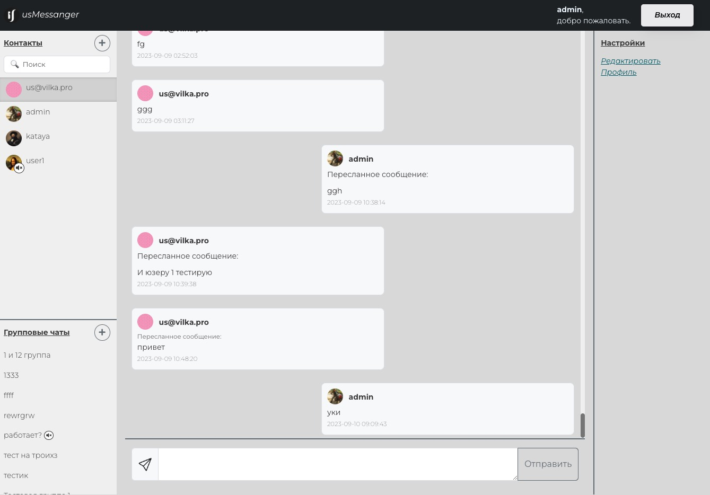

# Мой супер чат

## 1 - 2 . БД

ЗАДАЧА: БД сформирована с соблюдением нормализации, а соотношения в данных отвечают третьей нормальной форме.

ЗАДАЧА: В БД расставлены индексы.

РЕЗУЛЬТАТ: Ключи расставлены. Все понормально) 

--- 
 

## 3. Сообщения отправляются через асинхронное общение с сервером

Все работает через библиотеку Ratchet. Персональные и групповые сообщения ве четко отправляется. 

---
 

## 4. Принятие сообщения, его изменение и удаление происходит также без перезагрузки страницы

Сделано. Через ratchet и ajax 

---
 

## 5. Структура мессенджера отвечает макету в ТЗ

Сделано

---
 

## 6. Сообщение отправляется на сервер за время до 0.5с

Не знаю, как замерить, но все моментально на глаз.

---
 

## 7. Система не имеет уязвимостей вида: SQL-injection; CSRF attack; XSS attack.
 

Ну тут уж как смог. Вводил параметризированные запросы через MySQL

---
 

## 8. Система работает в многопользовательском режиме, не снижая производительности
 

Сколько смог пользователей посадить, никто не снизил производительности :)

---
 

## 8. Все библиотеки в коде подключаются через мессенджеры зависимостей

Да. Композер

---
 

## 8. Код отвечает стандартам: ECMA Script 6; PSR 1, 12, 2, 4.

Постарался, чтобы было красиво

---
 